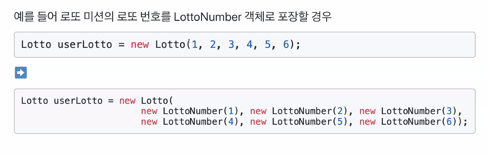
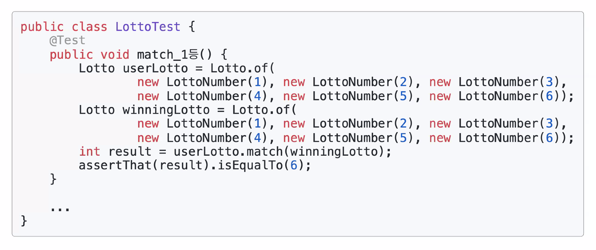

# TDD, 클린 코드 with Java 14기
TDD, 클린 코드 with Java 14기 강의 메모입니다.

## 3차 강의 * 클래스 분리 & immutable(5월 4일) 라이브 메모
* 객체 설계와 클래스 분리에 대한 두려움과 거부감 줄이기
* 정성적인 객체 설계의 어려움을 정량적인 원칙을 지키는 방식으로 도전
* 클래스 분리를 위한 정략적인 원칙 찾기
* 소트웍스 앤솔리지 책 중에서 객체지향 생활 체조 원칙
* 엘레강트 오브젝트 23가지 조언 중에서
* 클린코드 중에서
* 책을 읽으면서 정량적인 원칙을 찾기 위한 노력을 해본다

#### 소트웍스 앤솔리지 책 중에서 * 객체지향 생활 체조 원칙

* 원시값을 포장해라
* getter 메서드를 최대한 사용하지 마라
* 묻지말고 시켜라(메시지를 보내라)
* 생성자 정말 중요하다!!
* 일급콜렉션을 쓴다
* 3개 이상의 인스턴스 변수를 가진 클래스를 구현하지 않는다
    * 정말 구현하기 어렵다
    * 인스턴스 변수를 2개만 허용한다는 의미
* 도메인 객체와 테이블간의 관계가 1:1로 개발되고 있다 뭔가 잘못 되고 있따
* 보통 테이블 한개당 도메인 객체는 N개가 되어야 한다

#### 인스턴스 변수의 수를 줄이는 좋은 방법은?

* 중복된 값 또는 불필요한 인스턴스 변수를 있는지를 확인해 제거
* 관련있는 인스턴스 변수를 새로운 클래스(객체) 묶어서 분리
    * 원시값 포장
    * 일급컬렉션
    * 관련된 인자를 새로운 클래스로 묶어라
    * 프라이빗 메서드로 테스트 해야할 것 같으면 새로운 클래스로 분리할 것인지 의심해라 (feat. Enum)
    * 이러면 클래스가 작아지네 TDD하기 수월해지네? 이느낌을 받아야한다
    * Enum 안에 각각이 싱글 인스턴스이다
    * Enum은 상태를 변경하는 로직이 절대 있으면 안된다


#### Immutable vs Mutable

* 가능한 Immutable 객체로 개발해라!
* 문제점이 있다
    * 방어적 복사본을 위한 새로은 인스턴스를 많이 생성하게 된다.
    * 그럴땐 캐싱을 이용하자 ex) Map<Integer, LottoNo>
    * 인스턴스가 많이 만들어져서 이슈가되는 경우는 극소수다.
    * 대 부분 성능이슈는 데이터베이스 외부 API 등이다
    * 인건비가 더 비싸다!
* 클래스 분리할때 Immutable로 해라!!!!

#### 객체지향으로 개발하게 되면
* 첫 번째 테스트하기 쉬워진다
* 두 번째 비지니스 로직의 중복을 제거한다
* getter를 하는 순간 로직 중복이 일어난다
```java
int p = position.getPosition();
p = p + 1;
position.setPosition(p);
```
전형적인 절차지향적이다
C의 구조체 방식(메서드가 없기때문에)

Enum 은 클래스랑 똑같고
JVM 상 하나만 가지는 것만 보장해주는 것이다

#### 포비 말대로 미션 이외에도 다른 곳에서도 원시 값 포장을 적용해보려고 하고있습니다! 그런데 페이징 처리 같은 Page 도 포장을 해야할까요?
* Page 객체는 도메인 레벨이 아닌 것 같다 그래서 해당 객체는 원시값 포장안하고 도메인 관련 객체만 하는게 좋을 것 같다

#### 만약 getter를 쓰지 않는다면 이후에 Position이 ResultView까지 전달됐을 때는 어떻게 값을 얻는게 좋을까요?

* 마지막 단계에선는 getter 메서드가 필요할 수 있다
* View에서 필요한 데이터만 내려가야 한닫고 생각한다
* 필요할 수 있지만 최소화 하자(무조건 만들지 말자!)

#### UI를 제와한 모든 경우를 테스트하라는 요구사항이 있었는데요. Controller, View를 제외하고 도메인과 Service 계층이 남는데, Service가 도메인에 책임을 위임만 한다면 테스트할 필요가 없나요?

* 마지막날 집중적으로 이야기 할 것이다
* 무조건 테스트를 다 만드는게 유지보수와 개발측면에서 아닐 수 있다
* 우선순위가 있다 서비스 레이어는 1순위는 아니다

#### 래핑한 객체를 view에서 사용하기 위해 외부로 반환할 때 래핑된 그대로 반환하는 것이 좋을까요? 아니면 원시 형태로 풀어서 반환하는 것이 좋나요?

* Mutable 객체를 내려주는 것 보다는 Immutable 객체를 내려 줘라
* Mutable 객체를 어떻게 Immutable 객체로 반환해서 내려줄 것이냐가 중요하다
* 객체를 immutable 로 개발했을때 버그가 발생할 가능성이 낮아진다
* 상태값을 변경하는 로직이 중요한 로직이다
* 변경점을 최소화 하자
* 외부에서 상태값을 변경할 수 있는 여지를 줄이자

#### 여기서 RacingGame.java 를 컨트롤러 라고 부를 수 있는건가요?

* RacingGame은 도메인 객체이고
* RacingMain 이 컨트롤러라고 할 수 있다
* 굳이 컨트롤러를 만들어서 위임할 필요성 크게 의미 없다
* 너무 레이어드 아키텍쳐에 익숙해져서 그럴 수 있다
* 너무 강박처럼 컨트롤러 클래스 서비스 클래스 만드려고한다
* 그런데 정말 그 레이어가 필요한지 생각해보자
* 콘솔프로그램도 MVC기반으로 할 수 있다
* 서비스 레이어는 왜 필요한건가요?

#### 0개를 사용한다는 것과 <-> 인스턴스 변수를 2개 이하로 사용해보자는 것이 상충하는 부분도 있을것 같은데, 이 부분은 어떻게 하면 되나요?

* 인스턴스 변수는 관련있는 것끼리 묶는다
* WinningLottNumber 처림

#### 로또 결과 출력때 stream 여러번 호출을 줄이기 위해서 미리 결과 map을 만들고 꺼내고있는데요

* 로직에 대한 결과를 저장해놓으려고 하지말고
* 디비를 호출하는 로직이 없다면 성능상의 큰 이슈는 없다고 생각한다

#### 다른 분들이랑 커뮤니케이션 하는 능력을 키우면 좋다고 해주셨는데 의식적으로 어떤 노력을 하면 좋을까요?

* 소통의 1단계는 짝 프로그래밍을 하면 좋다고 생각한다
* 같은 관심사의 채널 내에서 짝 프로그래밍할 사람을  찾아라
* 그 다음에는 스터디!!
* 커뮤니터 스터디 활동 정말 추천한다!
* 짝 프로그래밍 하고싶은데 여기 분들 뵙기 너무 힘듭니다 SLiPP 게더 놀러오십셔!

#### 도메인을 잘 나눴을 때 모듈이나 프로젝트를 나눠서 이벤트호출 방식 등으로 구현을 한다면 분산트랜젝션은 전략은 어떤 방법이 있을까요?

* 즉시에 100% 트랜잭션을 보장하는건 어렵다고 생각한다
* 후처리를 통해서 데이터 정합성을 맞출 수 있는 방식으로 가야하지 않을까?
* 예전부터 트랜잭션이 하나로 묶이고 즉시에 데이터 정합성이 보장되어야한다고 생각하는데 예전 은행 로직처럼
* 후처리로도 데이터 정합성을 맞출 수 있는데 이런 부분을 활용하는 방법
* 너무 DBA나 기존 생각에 갇혀있으면 즉시에 보장되어야한다고 한다 하지만 이생각을 조금 바꿔서 후처리 전략으로(큐 같은걸 사용하거나) 가는 것도 방법이라고 생각한다
* 일시적으로 데이터 정합성이 안맞을 수 있지만 허용한 가능한 범위라고 본다면 괜찮지 않을까요

#### 분산트랙젠션 답변 주신 것에 이어서.. 그러면 트랜젝션이 중요한 부분이라도 도메인끼리 조금 섞어서 단일트랜잭션을 유지하는게 나을수도 있을까요?

* 여러 도메인이 후 처리가 안된다는건 너무 결합도와 커플링이 높아서 그런 것 아닐까 생각한다
* 지속 가능한 소프트 웨어 개발이 중요하다고 생각한다
* 객체지향 방법론을 저는 공부 많이했고 실제 사용해봐서 그런 저의 역량을 통해 더 유지보수하고 지속가능한 좋은 소프트 웨어 개발을 할 수 있을 거라 생각 합니다 이회사에도 도움이 될꺼다
* 몸값을 올리거나 스톡을주는 회사를 가는게 빠르다


## 5차 강의 - 책임주도 설계, 개발문화 만들기(6월 1일)
* IT업계는 어떤 다른 업계 보다 빠르게 변화하고있다
* 대량생산의 시대는 끝나가고 있다.
* 많은 직업이 인공지능으로 대체될 가능성이 높아지고 있다.
* 앞으로도 지금과 같이 고분고분 말 잘들으며 일하는 수동적인 삶이 성공적인 삶일까?
* 어떤 삶을 사는 것이 우리를 정말 필요한 사람, 없어서는 안 되는 사람으로 만들 것인가.
* 그럼 어떤 삶을 살아야 하나?
* 책 - 린치핀 추천
* 린치핀이란?
  * 새로운 길을 열고, 사람들을 이끌고, 사람들을 이어주고, 일을 만들어내고,
  * 혼란 속에서 질서를 창조하는 어떤 규칙도 없는 상황에서 무엇을 해야 하는지 찾아내는 모방 불가능한 사람들
  * 자신의 일을 사랑하고, 하루 하루를 작품과 같은 날로 마드는 예술가 기질을 발견한 사람들

* 답이 없는 곳에서 답을 찾아가는 모든 것이 예술이다
* 예술이란?
  * 자신의 인간성을 활용해 다른 사람의 변화를 이끌어내고자 하는 의도적인 행동
* 조직에서 자신을 중요한 인물로 만들어주고, 경쟁에서도 우위에 서도록 만들어주는 것은 바로 감정노동이다.
* 선택은 두 가지다.
  * 시스템(대표적으로 회사)의 평범한 톱니바퀴로 끝날 것인가?
  * 두려움에 굴복하고 시스템에 항복하는 선택을 할 것인가?
  * 작지만 강한 린치핀으로 거듭날 것인가?
  * 자신의 길을 헤쳐나가며서 그 길에서 가치를 만들어낼 것인가?
* 눈에 띄어라.
* 관대하라.
* 예술을 창조하라.
* 스스로 판단하라.
* 사람들과 관계를 맺어라.
* 아이디어를 공유하라.
* 그러면 보상 받을 것이다.
* 어떤 프로그래머의 삶을 살아야 할까?
* 소프트웨어 장인 책 추천
  * 소프트웨어 장인정신은 스스로가 선택한 직업에 책임감을 가지고, 지속적으로 새로운 도구와 기술을 익히며 발전하겠다는 마음가짐이다.
  * 소프트웨어 장인정신은 책임감, 프로페셔널리즘, 실용주의, 소프트웨어 개발자로서의 자부심을 의미한다.
* 린치팬과 소프트웨어 장인은 읽고 본인의 로드맵을 그려서 묵묵히 꾸준히 했으면 좋겠다
* 소프트웨어 장인이 가져야할 태도의 변화
  * 무엇인가 마음에 들지 않는다면 바꾸어라.
  * 그것을 바꿀 수 없다면, 그에 대한 당신의 생각을 바꾸어라 - 마리 엥겔브레이트
* 프로그래밍 역량에 대한 생각의 변화
  * 프로그래밍 역량은 개발자가 갖추어야 할 전부라고 생각하기 보다,
  * 개발자가 해야 하는 많은 일들 중 하나일 뿐이라고 생각하는 자세
  * 프로그래밍 역량 외에도 테스트, 배포 자동화, 고객/구성원들과의 협업, 문화 만들기 등에도 관심을 가지는 자세
* 테스트 코드에 대한 생각의 변화
  * 테스트 코드 구현은 QA가 담당한다고 생각하거나, 프로덕션 코드 구현과 별도의 작업으로 생각하기보다, 테스트 코드 구현까지 완료해야 기능 구현을 완료하는 것으로 생각.
* 레거시 코드에 대한 생각의 변화
  * 레거시 코드를 바라볼 때 짜증나고, 고통스런 일로 바라보기 보다, 재미있고, 도전적인 문제로 바라보는 자세
* 무리한 일정과 업무 요청에 대한 생각의 변화
  * 무리한 일정과 변경 요구에 무조건적으로 ‘예'라고 말하기 보다, ‘아니오'라는 말을 하고 대안을 제시하는 자세
* 자기 성장에 대한 생각의 변화
  * 회사나 선배 개발자가 성장시켜 주기를 바라기 보다, 자신의 시간과 돈을 들여 스스로 성장하려는 자세
  * 기업이 개발자에게 자기계발을 할 시간을 준다면 보너스나 배려로 생각한다.
* 성장에 대한 생각의 변화
  * 나 혼자 성장하는 것에만 관심을 가지기 보다
  * 후배들을 키우고, 커뮤니티를 통해 같이 학습하고, 지식을 공유해 소프트웨어 산업 생태계에도 기여하려는 자세
* 소프트웨어 장인에게 가장 필요한 자질은 정직과 용기
  * 모르는 것에서 모른다 할 수 있는 자세 - 정직
  * 일정에 대해 아니라고 하는 자세 - 용기
* 왜 소프트웨어 장인의 길을 걸어야 하나?
  * 우리가 더 행복하고, 자유롭고, 즐겁게 일하기 위해
  * 우리가 특정 회사, 고용주에게 종속되지 않고, 인간으로서의 존엄성을 유지하면서 살아가기 위해
  * 교육자의 삶을 병행하는 것도 좋을 것 같다
  * 한 명이 두 세가지의 일을 하면서 자유롭게 일을 하는 시대가 오고 있다고 생각 한다 특히나 우리 업계가 가장 빠르게 변화하고 있다
  * 너무 한 가지만 하려고 하지말자 여러가지 일을 하면서 사는 방법도 있다.

#### 원시 값, 문자열 포장하면서 객체 생성시 고민하게 되는 이슈
이슈 - 객체 생성할 때 구현 코드의 양이 증가함


* 생성자를 여러개 만들어서 해결하면 된다.
* 해결책 - 생성자 하나를 주 생성자로 만들어라
* 클래스를 잘 설계한다면, 클래스는 많은 수의 생정자와 적은 수의 메서드를 포함할 것이다.
* 2, 3개의 메서드와 5~10개의 생성자를 포함하는 것이 적당하다.
* 이런 기준을 두는 핵심은 응집도가 높고, 견고한 클래스에는 적은 수의 메서드와 상대적으로 더 많은 수의 생성자가 존재한다는 점이다.
* 메서드가 많아지면 클래스의 초점이 흐려지고, 단일책임원칙을 위배할 가능성이 높아진다.


* 생성자를 여러개 추 가할때 궁금한 것이 하나있는데 부 생성자가 주생성자를 호출안하고 다른 부생성자를 호출하는것은 어떻게 생각하세요??
  * 괜찮다고 생각한다 그 정도의 성능저하는 감수할만 하다
* 불변객체로 만들어라
  * 모든 클래스를 상태변경이 불가능한 불변 클래스(immutable class)로 구현하면 유지보수성을 크게 향상시킬 수 있다.
  * 불변 객체를 기반으로 사고하면 더 깔금하고, 더 작고, 더 쉽게 이해할 수 있는 코드를 구현할 수 있다.
* 이슈 - immutable object 관련해 종종 듣는 질문
  * immutable object(불변 객체)가 좋은 것은 알겠는데, 인스턴스가 너무 많이 생성되어 성능이 떨어지는 것은 아닌가?
  * 질문삭제 리팩토링 미션에서처럼 상태가 변경되어야 하는 객체도 불변객체로 구현하는게 의미가 있을까요?
  * 의미가 있다
    * 불변객체로 가능한 만들려고 노력해보아라
    * 데이터가 변경되기때문에 가변객체로 만들어야지하고 빠르게 판단하지말고 가능한 불변객체로 만들어보는 노력을 하고나서 도저히 안되면 가변객체로 하는 방향으로 해보자
    * OOP, 클린코드를 하기위한 원칙을 가지고 프로그래밍을 하자


