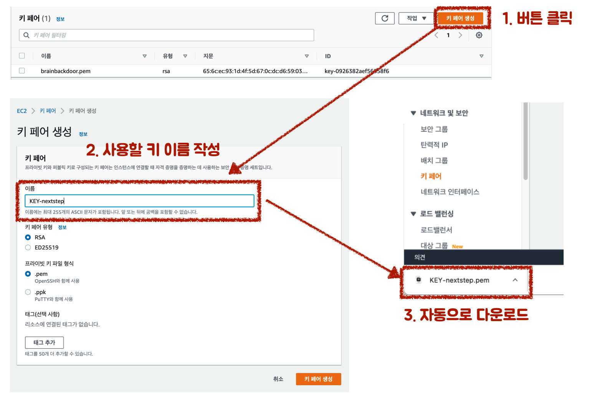
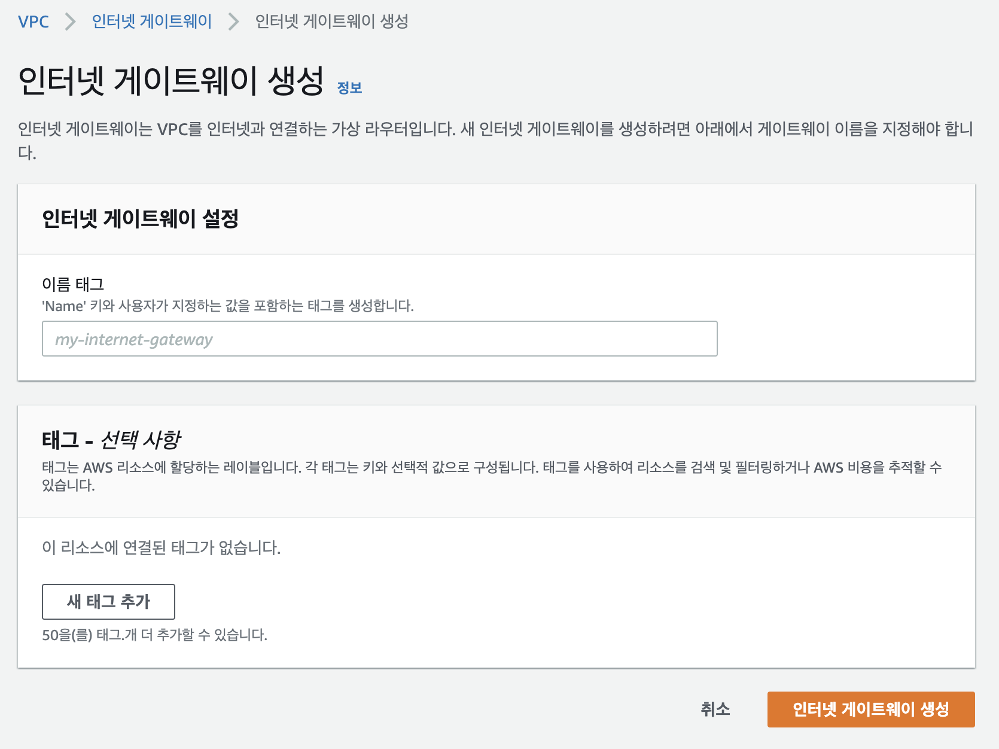

# 인프라 공방 6기
인프로 공방 6기 메모입니다.

## 그럴듯한 인프라 만들기
### 0단계 - pem 키 생성하기

* AWS Console 접속
* `EC2` -> `네트워크 및 보안` -> `키 페어` 메뉴 클릭
* `키 페어 생성` 버튼 클릭
* 키 페어 이름 입력 후 `키 페어 생성` 버튼 클릭
* 자동 다운로드 된 *.pem 파일 저장

### 1단계 - 망 구성하기
#### VPC 생성
* `VPC` -> `VPC 생성` 버튼 클릭
* `VPC 이름` 입력
* `IPv4 CIDR` 입력
* `VPC 생성` 버튼 클릭

#### Subnet 생성

#### 인터넷 게이트웨이 생성
`VPC` -> `인터넷 게이트웨이 생성` 버튼 클릭
* 인터넷게이트웨이 VPC 연결
* 라우팅 테이블 생성
* 0.0.0.0/0 대상에 인터넷 게이트웨이 연결
* 퍼블릭 서브넷 연결

#### NAT 게이트 웨이 생성
* 탄력적 IP 할당
* 퍼블릿 서브넷 지정

