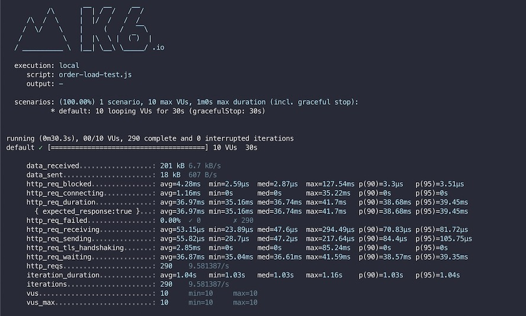

# k6로 부하테스트 시작하기 

## k6 설치

`Amazon Linux 2`는 k6에서 사용하는 PGP V4 서명을 지원하지 않기 때문에 설치시 비활성화 옵션을 추가하여 설치
```shell
$ sudo yum install https://dl.k6.io/rpm/repo.rpm
$ sudo yum install --nogpgcheck k6 -y
```

## k6 실행
k6는 JavaScript ES6 모듈로 작성할 수 있다.  
다음 코드를 복사하여 script.js로 저장하자.

```js
import http from 'k6/http';
import { sleep } from 'k6';
export const options = {
  vus: 10,
  duration: '30s',
};
export default function () {
  http.get('http://test.k6.io');
  sleep(1);
}
```

다음 명령으로 k6를 실행할 수 있다.
```shell
$ k6 run script.js
```

## 실행결과
  


300번의 요청이 아닌 총 290 번 실행한 것을 알 수 있다.  
`sleep(1)`이 주어졌기 때문에 290번 실행된 것이다.  
즉, 초당 10명의 가상유저가 30초 동안 요청을 한 것이다.


## 참고
* https://k6.io

